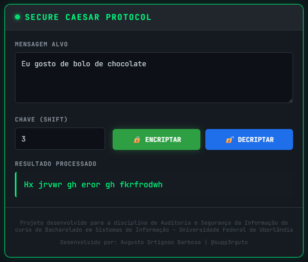
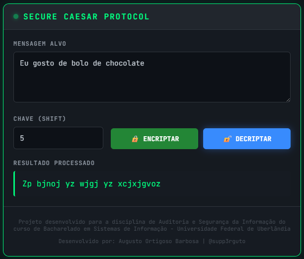

# 🔐 Secure Caesar Protocol - Cifra de César Full Stack


Este projeto é uma aplicação web **Full Stack** desenvolvida para a demonstração didática de algoritmos de criptografia clássica (Cifra de César) utilizando uma **arquitetura moderna e desacoplada**.
A solução simula um ambiente seguro onde a lógica de criptografia reside isolada no servidor (Backend), enquanto o cliente (Frontend) atua apenas como interface de comando, garantindo a integridade do processo.

## 🎓 Contexto do Projeto

Projeto desenvolvido como **Proof of Concept (PoC)** para a disciplina de **Auditoria e Segurança da Informação** do curso de Bacharelado em Sistemas de Informação da **Universidade Federal de Uberlândia (UFU)**.
O objetivo foi criar uma ferramenta visual para validação de conceitos de confidencialidade e integridade de dados em trânsito via API REST.

## ✨ Funcionalidades Principais

* **Criptografia Remota (Encryption):** Envio de mensagens em texto plano para processamento seguro no backend, aplicando o deslocamento (shift) definido pelo usuário.
* **Descriptografia (Decryption):** Reversão da lógica matemática para recuperação da mensagem original, validando a simetria do algoritmo.
* **Interface Cyberpunk/Security:** UI desenvolvida com design system focado em "Glassmorphism" e estética hacker, proporcionando imersão ao usuário.
* **API Stateless:** O backend processa as requisições sem armazenar estado (banco de dados), funcionando como um microserviço de utilidade criptográfica puro.

## 📸 Galeria do Sistema

| Operação de Encriptação | Operação de Decriptação |
|:---:|:---:|
|  |  |

## 🚀 Arquitetura e Tecnologias

A solução segue o padrão de **Arquitetura Cliente-Servidor**, isolando a regra de negócio (matemática da cifra) da interface do usuário.

### 🐍 Backend (Python & Flask)
Atua como o motor criptográfico da aplicação.

* **Python 3:** Linguagem escolhida pela robustez em manipulação de strings e matemática.
* **Flask:** Microframework leve para expor os endpoints da API REST.
* **CORS:** Configurado para permitir requisições seguras apenas da origem do frontend.

### ⚛️ Frontend (Angular)
Interface moderna e reativa para interação com o usuário.

* **Angular 17+ (Standalone):** Utilizando a arquitetura mais recente sem módulos (`NgModule`), focada em performance.
* **TypeScript:** Para tipagem segura dos dados enviados e recebidos.
* **CSS3 Glassmorphism:** Estilização avançada com efeitos de transparência, *blur* e brilho neon.
* **HttpClient:** Gerenciamento de requisições assíncronas para comunicação com o Python.

## 💻 Como Rodar o Projeto

Como é uma aplicação Full Stack, é necessário rodar os dois terminais simultaneamente.

### 1. Backend (Servidor)
```bash
cd backend
# Ativar ambiente virtual (Opcional, mas recomendado)
# Windows: venv\Scripts\activate
# Linux/Mac: source venv/bin/activate

pip install -r requirements.txt
python app.py
```
O servidor iniciará em http://127.0.0.1:5000

###2. Frontend (Cliente)
```bash
Bash
cd frontend
npm install
ng serve
```
Acesse a aplicação em http://localhost:4200

## 👨‍💻 Autor
**Augusto Ortigoso Barbosa**
* **GitHub:** [github.com/supp3rguto](https://github.com/supp3rguto)
* **LinkedIn:** [linkedin.com/in/augusto-barbosa-769602194](https://www.linkedin.com/in/augusto-barbosa-769602194)
